# Low Level Flow Diagrams - Your Docs

Ye document Your Docs project ke low-level flows ko diagram form me explain karta hai. Diagrams Mermaid syntax me hain, isliye GitHub/Markdown viewers me render ho sakte hain.

## 0. Ready Image Version

Image file:

- [backend/diagrams/low_level_flow.svg](/C:/Your%20Docs/backend/diagrams/low_level_flow.svg:1)

## 1. Complete System Flow

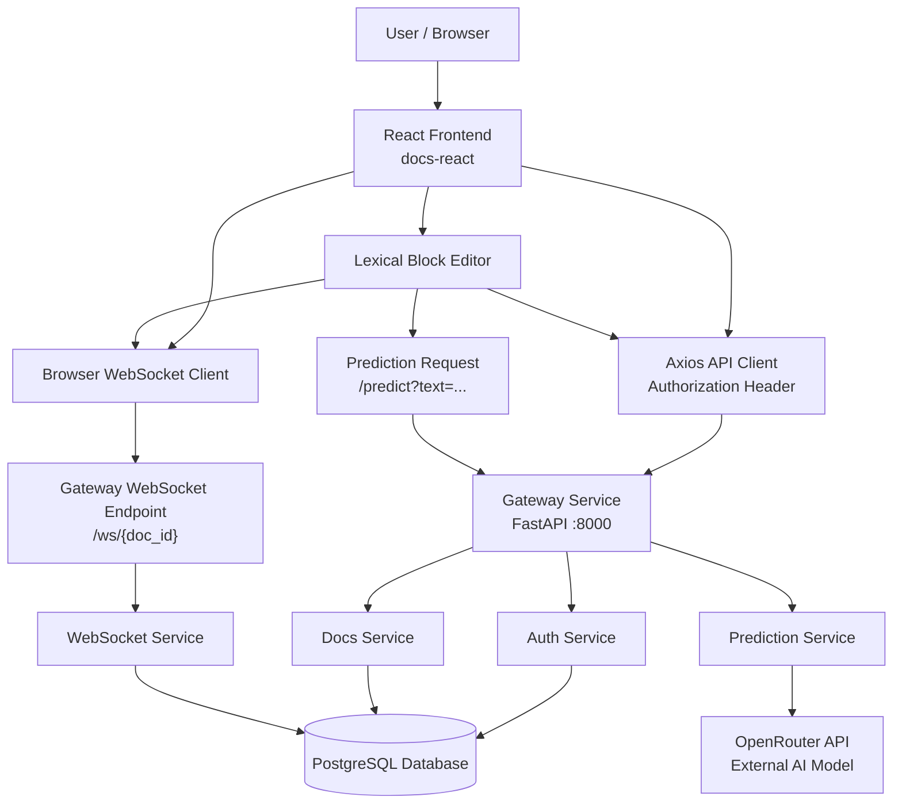

## 2. Login Flow

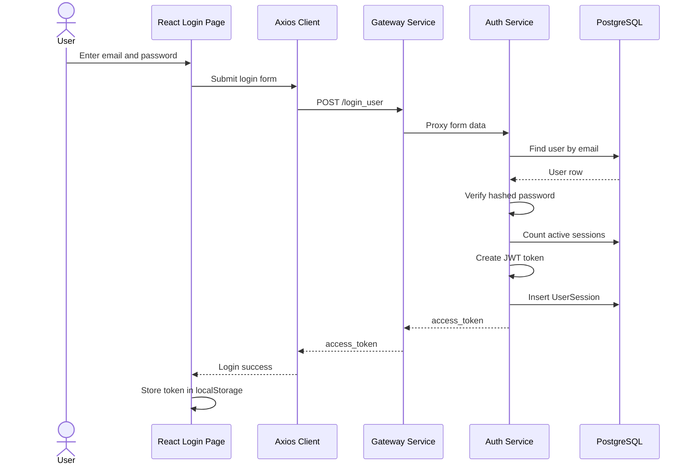

## 3. Authenticated API Request Flow

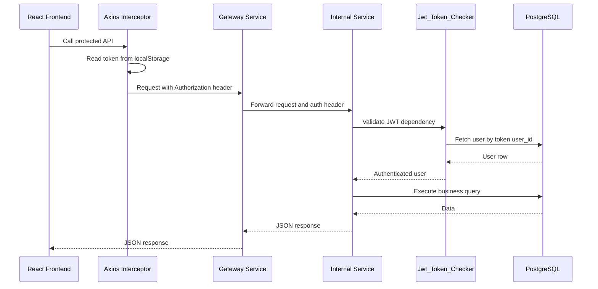

## 4. Create Document Flow

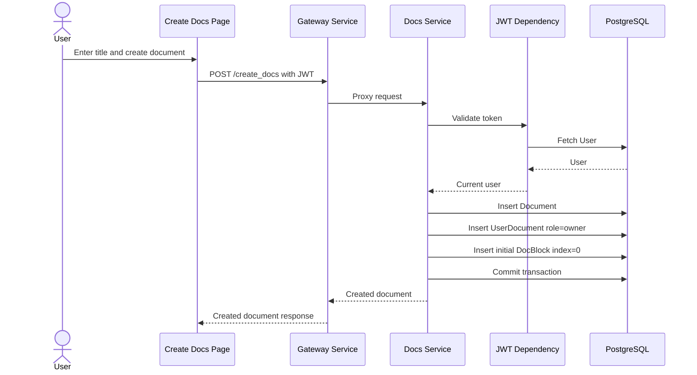

## 5. Open Document Flow

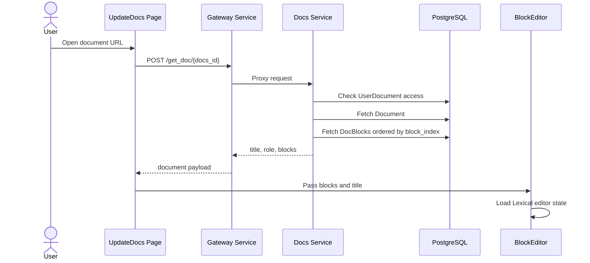

## 6. Save Document Flow

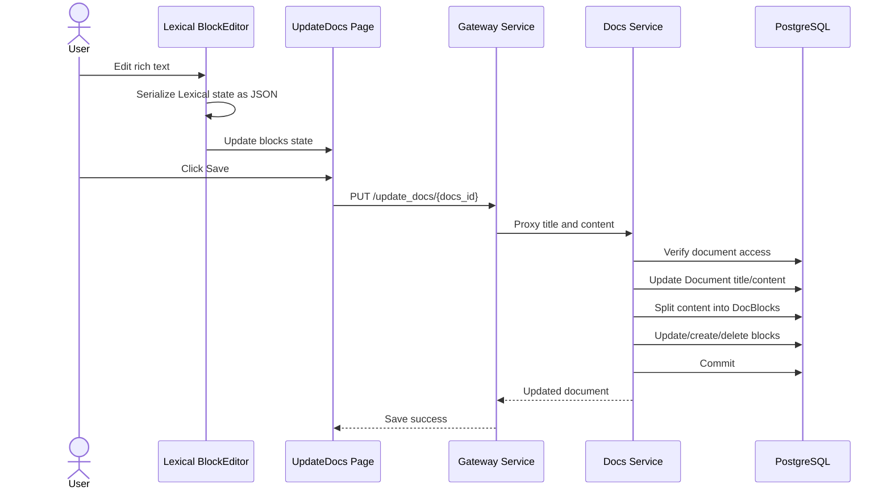

## 7. Live Collaboration Flow

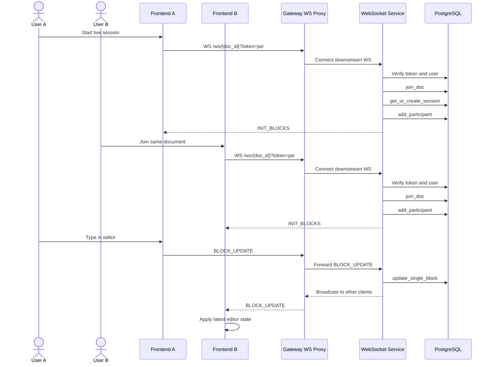

## 8. WebSocket Message Handling Flow

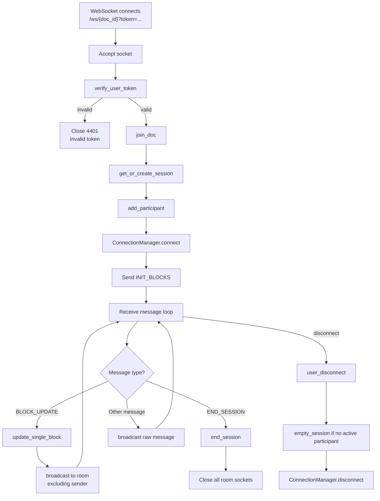

## 9. Prediction Flow

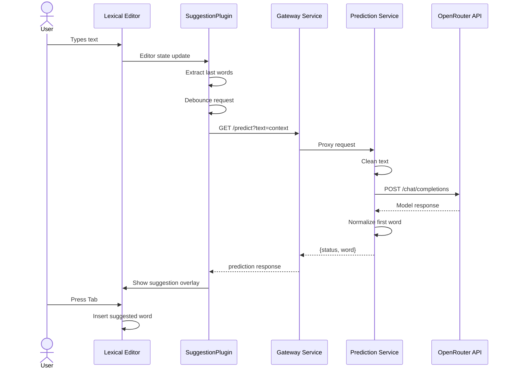

## 10. Prediction Fallback Flow

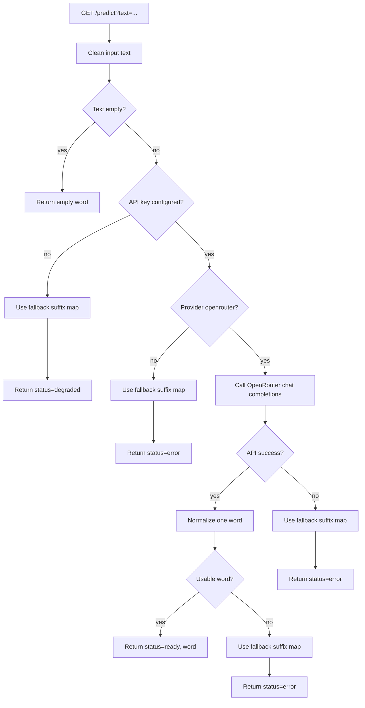

## 11. Database Relationship Diagram

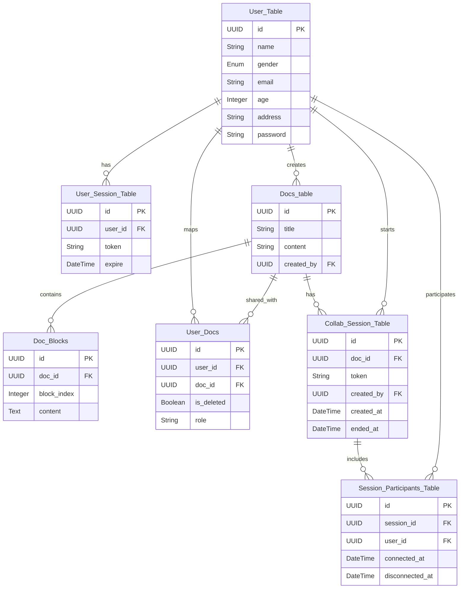

## 12. Deployment Flow

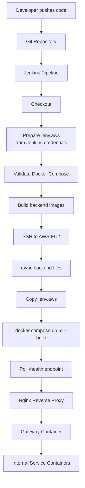

## 13. Runtime Container Flow

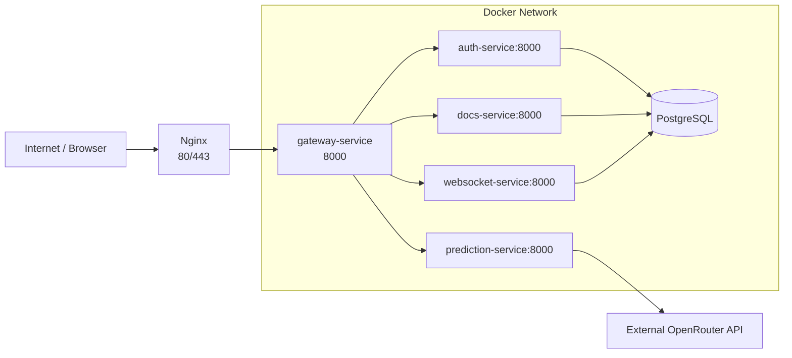

## 14. Low Level Component Dependency Flow

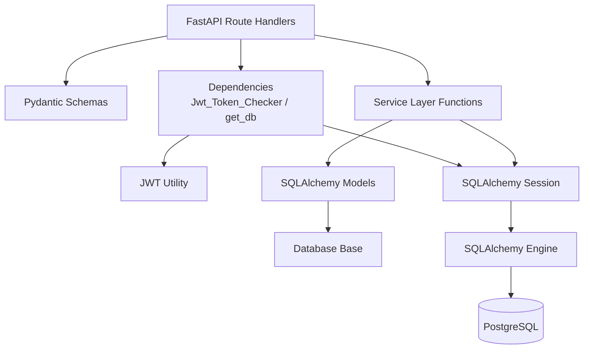

## 15. Summary

Low-level flow ke hisaab se project ka main runtime control center `gateway-service` hai. Frontend sirf gateway ko call karta hai, gateway request ko auth/docs/prediction/websocket services tak forward karta hai, aur database operations service layer ke through SQLAlchemy models par execute hote hain.

Live collaboration WebSocket service ke in-memory room manager par based hai, prediction external OpenRouter API par based hai, aur deployment Docker Compose plus Jenkins automation ke through manage hota hai.
